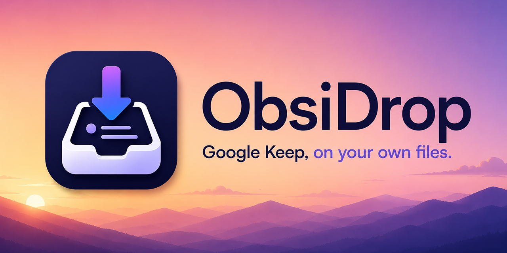
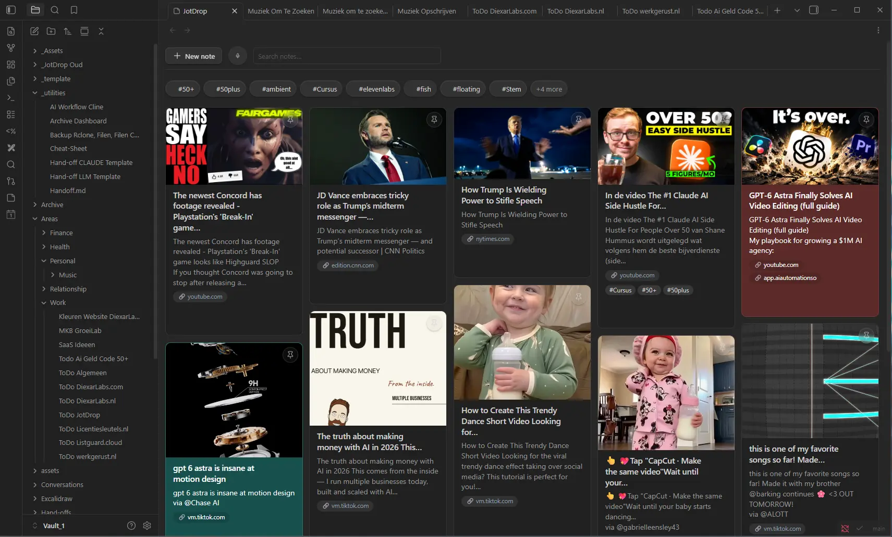
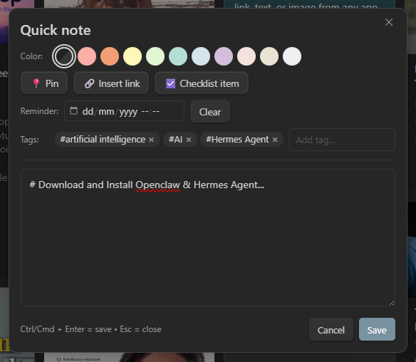
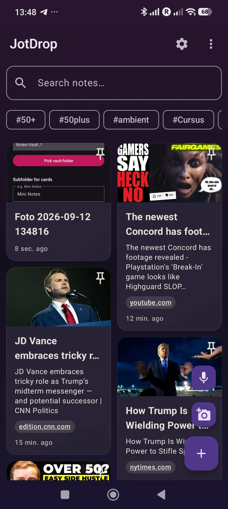
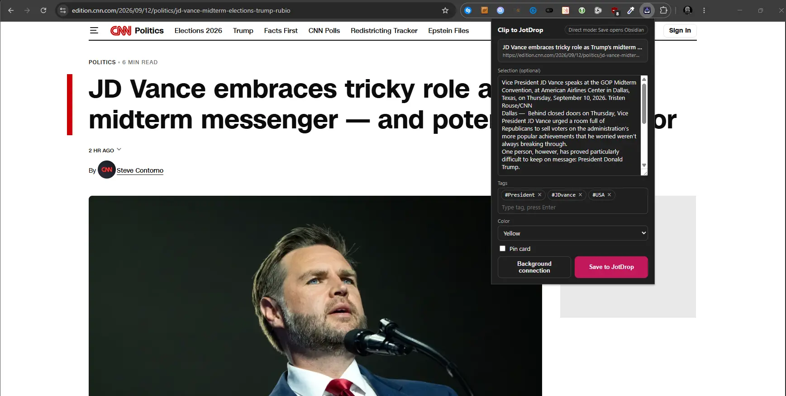
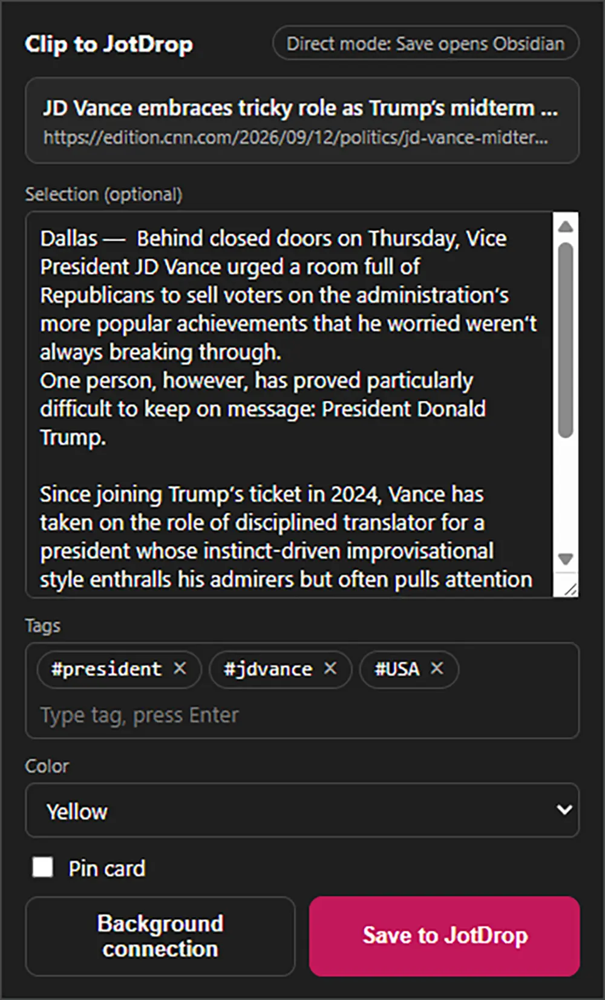
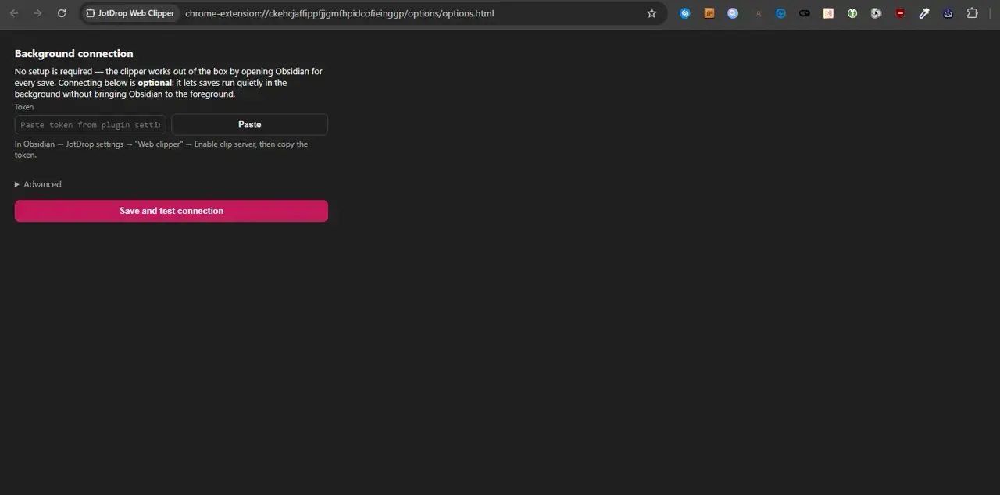

<div align="center">



# JotDrop

**Google Keep, on your own files.**

JotDrop is a free, open-source **Google Keep alternative** for [Obsidian](https://obsidian.md/). It's a **trio**: the plugin (the card grid in your vault), a companion **Android app** (share-sheet capture, OCR, voice memos), and a **Chrome web clipper**. Sync them with [Syncthing](https://syncthing.net/) and you have Google Keep, fully offline, fully yours.

> **For the full Google Keep experience, install all three.** Install the plugin from Obsidian Community plugins, download the [Android APK](https://github.com/Diexar-Labs/jotdrop/releases/download/v0.28.1/jotdrop.apk), and install the [Web Clipper from the Chrome Web Store](https://chromewebstore.google.com/detail/obsidrop-web-clipper/mkgcicjljogifeaccaclbcoemllmgjfo) — one click, automatic updates, works without any configuration.

[](LICENSE)
[](https://github.com/Diexar-Labs/jotdrop/releases)
[](https://github.com/Diexar-Labs/jotdrop/releases/download/v0.28.1/jotdrop.apk)
[](https://github.com/Diexar-Labs/jotdrop/actions/workflows/android-build.yml)

[Download](#install) · [Screenshots](#screenshots) · [How it works](#how-it-works) · [Roadmap](#roadmap)

</div>

---

## Why JotDrop?

JotDrop is a private, open-source **Google Keep alternative**. Google Keep is great - until you remember Google reads everything you put in there. JotDrop gives you the same fast, friction-free "dump a thought" experience, but every note is a plain Markdown file in your own Obsidian vault. No cloud account, no ads, no telemetry, no lock-in. Sync between phone and laptop with Syncthing (free) or any folder-sync you already use.

- **Quick capture, anywhere.** Share a link from any Android app → JotDrop turns it into a note with a preview card. Open the app, tap once, type, done.
- **Card grid in Obsidian.** A dedicated view shows your notes as Keep-style cards: titles, colors, tags, archived, pinned-on-top. Filter, sort, search.
- **Plain Markdown, always.** Notes are `.md` files with YAML frontmatter. They live in your vault. You can edit them anywhere - Obsidian, VS Code, Vim, mobile.
- **Offline by default.** No server. No account. Works on a plane.
- **Open source, free, no premium tier.** MIT-licensed.

## Screenshots

<p align="center">
  
  <br/><sub><em>Obsidian desktop - Keep-style card grid</em></sub>
</p>

<table>
  <tr>
    <td align="center" width="60%">
      
      <br/><sub><em>Quick-note editor - colors, tags, checklist, pin</em></sub>
    </td>
    <td align="center" width="40%">
      
      <br/><sub><em>Android - home screen</em></sub>
    </td>
  </tr>
</table>

## Features

### Capture
- Android **share-target** - share any link, text, or image from any app
- **Standalone Android app** for typing/dictating notes directly
- **Voice memos** - one-tap recording on the dashboard, on both Android (`.m4a`) and the Obsidian plugin (`.webm`/opus); a confirmation dialog asks before saving, audio lands as a card with an equalizer-banner thumbnail
- **Voice-to-text** on Android (uses system speech recognizer)
- **OCR** on photos via ML Kit (text-recognition v2, bundled in APK - no Google Play Services needed)
- **Link previews** (Open Graph) - paste a URL, get a card with title, image, and source

### Organize
- **Colors** (11 swatches, colorblind-friendly labels)
- **Tags** - typed inline or picked from existing; **filter-chip strip** under the search bar (top-N by frequency, "+N more" sheet for the long tail)
- **Bulk-select** - long-press a card to enter multi-select; bulk archive or delete with confirmation
- **Archive** with one tap, restore anytime
- **Pinned** notes float to the top
- **Search & filter** across body, title, tags
- **Reminders** - per-note due-date with Android notifications; "Due" / "Overdue" badges on the card; survives reboot

### Edit
- Inline **`- [ ]` checklists** with smart toolbar toggle
- **Image embeds** (`![[image.jpg]]`) shown as thumbnails on the card
- **Audio embeds** (`![[memo.m4a]]`): inline player in both the Android editor and the Obsidian edit modal; tap a voice-memo card to play it back
- **Lightbox** - tap a thumbnail to view full-screen, with "Open externally" fallback
- **Auto-saves** as you type (and on back-button)
- **Live preview** of pasted links
- **Refcount-aware delete**: when you remove a card, its embedded image/audio is moved to the OS recycle bin too, but only if no other card (incl. Archive) still references it (so shared OG-thumbnails stay safe)

### Clip the web
- **Chrome extension** companion - one-click clip of the current page into your vault as a Markdown note, tags, color, pin and selection included
- **Zero-config by default** - saving opens Obsidian via the local `obsidian://` protocol and creates the card; no token or port setup needed
- **Optional background connection** - pair once with the plugin's localhost server (127.0.0.1, token-authenticated) for silent background clipping; on any failure the clipper falls back to the direct URI, so a clip is never lost

### Sync
- Files written as `<date>-<slug>.md` with YAML frontmatter (color, tags, archived, pinned)
- Designed to coexist peacefully with [Syncthing](https://syncthing.net/) - placeholder + finalize handshake avoids edit-conflicts
- Works with the official Obsidian Sync, iCloud, Dropbox, or any folder sync

## Install

> **TL;DR:** install the plugin from Obsidian, use the versioned Android APK link below, and load the Chrome extension from this repository. No build tools needed.

JotDrop is a **trio**. Each part works on its own, but you only get the full Google Keep experience when all three are installed:

1. **[Obsidian plugin](#obsidian-plugin-desktop--mobile)** - the Keep-style card grid: view, organise, edit.
2. **[Android app](#android-app)** - capture from anywhere: share-sheet, OCR, voice memos.
3. **[Chrome extension](#chrome-extension-web-clipper)** - clip web pages straight into your vault.

### Web clipper (recommended route)

Install [JotDrop Web Clipper from the Chrome Web Store](https://chromewebstore.google.com/detail/obsidrop-web-clipper/mkgcicjljogifeaccaclbcoemllmgjfo). That's the recommended route: one-click install from the store, automatic updates, and your existing item/users are preserved.

### Obsidian plugin (desktop + mobile)

**Easiest (via Community plugins, recommended):**

1. Open Obsidian → Settings → Community plugins → **Browse**.
2. Search for **JotDrop** and click Install, then Enable.
3. Click the sticky-note icon in the left ribbon (or run command "JotDrop: Open Keep view").

**Manual install (for offline / pre-release versions):**

1. Go to the [current plugin release](https://github.com/Diexar-Labs/jotdrop/releases/tag/0.20.3).
2. Download `manifest.json`, `main.js`, and `styles.css`.
3. Put them in `<your-vault>/.obsidian/plugins/jotdrop/` (create the folder if it doesn't exist).
4. Open Obsidian → Settings → Community plugins → enable **JotDrop**.

### Android app

1. Download [`jotdrop.apk` for Android 0.28.1](https://github.com/Diexar-Labs/jotdrop/releases/download/v0.28.1/jotdrop.apk).
2. Open the file on your phone → Android will ask permission to install from unknown sources → grant it.
3. Open JotDrop → first screen lets you pick the vault folder (the same one you sync to your laptop).
4. From now on, the share-sheet in any app includes JotDrop.

> **Signing note:** GitHub APKs currently use the repository's published compatibility key so they can update existing sideloaded installations. Because that key is public, it is not proof of authenticity. Download APKs only from the versioned `Diexar-Labs/jotdrop` release URL above and verify the linked Actions build.

### Syncing the two

Install [Syncthing](https://syncthing.net/) on phone + laptop, point both at your vault folder. Within 30 seconds of capturing on your phone, the note shows up in Obsidian. That's the entire setup.

> **Recommended Syncthing setting:** enable **File Versioning** on the shared folder (Simple Versioning is fine), on both devices. Deleted and overwritten files are kept in `.stversions/` so an accidental delete (or a sync race, see [Known issues](#known-issues)) is recoverable instead of permanent.

### Chrome extension (web clipper)

Part three of the trio - this is what replaces Keep's browser extension.

**Recommended: install from the [Chrome Web Store](https://chromewebstore.google.com/detail/obsidrop-web-clipper/mkgcicjljogifeaccaclbcoemllmgjfo).** One click, automatic updates, no configuration needed.

<p align="center">
  
  <br/><sub><em>Web Clipper popup - title, selection, tags, color, pin, one-click save</em></sub>
</p>

<table>
  <tr>
    <td align="center" width="40%">
      
      <br/><sub><em>The popup up close</em></sub>
    </td>
    <td align="center" width="60%">
      
      <br/><sub><em>Optional Background connection - saving runs silently</em></sub>
    </td>
  </tr>
</table>

**Zero-config quick start:**

1. Install the JotDrop plugin in Obsidian.
2. Install the [Web Clipper](https://chromewebstore.google.com/detail/obsidrop-web-clipper/mkgcicjljogifeaccaclbcoemllmgjfo) from the Chrome Web Store.
3. Click the JotDrop icon on any page and press **Save** - Obsidian opens and creates the card.

That's the whole setup. Saving works through the local `obsidian://` protocol, so no token or port is required.

**Optional: Background connection** (after the default path works): pair the clipper with the plugin's clip server once and saves run silently in the background without bringing Obsidian to the foreground. In Obsidian: Settings → JotDrop → Web clipper → enable the clip server and copy the token; in the extension: right-click the icon → **Background connection** → paste the token → **Save and test connection**. The server binds only to `127.0.0.1` and never exposes itself on the network. If the connection fails, the clipper automatically falls back to the direct URI - a clip is never lost.

**Manual ZIP installation (fallback):**

1. Download the ZIP from the [latest clipper release](https://github.com/Diexar-Labs/jotdrop/releases?q=web-clipper-v&expanded=false) and extract it into a permanent folder.
2. Open `chrome://extensions` in Chrome / Edge / Brave.
3. Toggle **Developer mode** on.
4. Click **Load unpacked** and select the extracted folder containing `manifest.json`.

**Manual updates:** replace the files in the same permanent folder with a newer ZIP's contents and click **Reload** on the extension card in `chrome://extensions`. Store installations update automatically.

**Troubleshooting:**

| Problem | Fix |
| --- | --- |
| Obsidian does not open on Save | Open Obsidian desktop at least once so the `obsidian://` protocol is registered, then save again. |
| Background connection test fails | Obsidian desktop, the JotDrop plugin, and its clip server must be running; re-copy the token from the plugin settings. |
| Wrong port or token | Open **Background connection → Advanced**, correct the port (default 27124), and paste the token again. |
| "Selection too long for direct mode" | Shorten the selected text, or enable the Background connection (it supports much larger quotes). |

### Staying up to date

Manual installs don't auto-update, so here's how to get notified of new releases:

- **Obsidian plugin (via Community plugins):** once installed from Browse, Obsidian checks daily and shows an "Update available" badge in Settings → Community plugins. One click updates it.
- **Obsidian plugin (manual / pre-release):** use [BRAT](https://github.com/TfTHacker/obsidian42-brat) ("Obsidian42 - BRAT"). Add `Diexar-Labs/jotdrop` as a beta plugin; BRAT watches this repo's releases and updates the plugin for you.
- **Android app:** the sideloaded APK won't update itself. With [Obtainium](https://github.com/ImranR98/Obtainium), add `https://github.com/Diexar-Labs/jotdrop`, select only releases tagged `v*`, and select the `jotdrop.apk` asset.
- **Anyone:** on [this repository](https://github.com/Diexar-Labs/jotdrop), click **Watch → Custom → Releases** to get a notification on every new release.

## How it works

JotDrop is intentionally simple plumbing:

- Each note is a plain Markdown file in `<vault>/Mini Notes/` (folder configurable).
- Attachments (photos, voice memos, link-preview thumbnails) are stored in a **configurable vault-relative folder**. By default that is `.attachments` inside the notes folder; set an explicit folder (e.g. `assets`) in the plugin settings and the Android app. Set the same value on both devices. Changing the folder only affects new captures; existing files are not moved, and JotDrop still finds them via the legacy location.
- Metadata lives in YAML frontmatter at the top:
  ```yaml
  ---
  color: amber
  tags: [idea, work]
  archived: false
  pinned: false
  ---
  ```
- The Android app writes the file. The Obsidian plugin reads it. They never talk to each other - they meet in the vault.
- Link-preview cards are written as a "pending" placeholder by Android, then the plugin (or Android) fetches the Open Graph data and rewrites the note. A race-safe marker check prevents either side from overwriting user edits.

This is why JotDrop **needs no server, no account, no API key** - and why anything that can write to the same folder (e.g. a `curl` script, a Shortcuts automation) can capture into it.

## Known issues

### Bulk delete while a sync peer is offline

If you bulk-delete many notes in the plugin while another device (phone or laptop) running Syncthing is **offline**, the deletes may be "resurrected" when that peer reconnects: the offline peer still has those files with valid version metadata, and on reconnect Syncthing can side with the peer and push the files back to the device that deleted them.

This is Syncthing reconciliation behavior, not specific to JotDrop; single deletes you do while everything is online propagate fine. It's the combination of *bulk* delete and an *offline* peer that triggers it. Mitigations:

- Make sure Syncthing is **running on every device** before bulk-deleting, and stays running for ~30s after so the deletes propagate.
- Enable **File Versioning** in Syncthing (see [Syncing the two](#syncing-the-two)). Even if files do come back, you have copies in `.stversions/` to delete from properly.
- The bulk-delete confirmation dialog reminds you of this: it's not paranoia, it's avoiding this exact failure mode.

## Languages

UI in English (default) and Dutch. Skeletons exist for **Spanish, German, French, Italian** - empty files are present in [`src/i18n.ts`](src/i18n.ts) and [`android/app/src/main/res/values-*/`](android/app/src/main/res/). PRs with translations very welcome - see [Contributing](#contributing).

## Roadmap

- [x] Card grid in Obsidian
- [x] Android share-target
- [x] OCR + voice-to-text on Android
- [x] Link previews (Open Graph)
- [x] Checklists
- [x] Multi-language (EN/NL + skeletons)
- [x] Reminders / due-dates
- [x] Web clipper (Chrome extension)
- [x] Tag-filter chips + bulk-select (multi-archive / multi-delete)
- [x] Lightbox for image embeds
- [x] Voice memos (record + playback, both platforms)
- [x] Submit to official Obsidian community-plugins register
- [ ] iOS share-target (share-extension)
- [ ] Firefox / Edge clipper (the Chrome extension is MV3, should port cleanly)

## Contributing

This is a hobby project I share publicly. PRs welcome for:
- **Translations** - drop strings into `src/i18n.ts` and the matching `android/.../values-*/strings.xml`
- **Bug fixes**
- **Small features** that fit the "minimal" philosophy

For larger ideas, open an issue first to chat about it. No CLA, no commit-message gatekeeping; just keep it tidy.

## Support

Open source, MIT-licensed, no premium tiers. If JotDrop saves you time and you feel like saying thanks:

<a href="https://ko-fi.com/L3L11ZETB9"></a>
&nbsp;
<!-- GitHub Sponsors badge will be added once approval is in -->

No subscriptions, no obligations, no DMs. Totally optional.

## Build from source

If you build from source, always use the optimized release APK. Debug APK
generation and installation are disabled because Compose debug builds have
unusable scroll performance.

**Plugin:**
```bash
npm install
npm run build
# main.js + manifest.json + styles.css end up in repo root
```

**Android:**
```bash
npm run android:release
# APK at android/app/build/outputs/apk/release/app-release.apk
npm run android:verify -- android/app/build/outputs/apk/release/app-release.apk
npm run android:install -- android/app/build/outputs/apk/release/app-release.apk
```

Before merging a port, use `npm run android:test-release` for the same R8
optimized release variant with the feature-branch base check. It is for local
testing only; production release builds still require `npm run android:release`.

The release command requires a clean checkout at live `origin/main`, JDK 17,
and Android SDK 34. The committed Gradle wrapper pins Gradle 8.7.
`compileDebugKotlin` is available for CI compile validation, but it does not
produce an installable APK.

## Credits

Built by [Diexar Labs](https://github.com/Diexar-Labs). Uses [Obsidian's plugin API](https://docs.obsidian.md/Plugins/Getting+started/Build+a+plugin), [Jetpack Compose](https://developer.android.com/jetpack/compose), and Google's [ML Kit Text Recognition](https://developers.google.com/ml-kit/vision/text-recognition).

Inspired by Google Keep (the good parts) and by [the Obsidian community's](https://obsidian.md/community) belief that your notes belong to you.

## License

[MIT](LICENSE) - do whatever you want with it.
